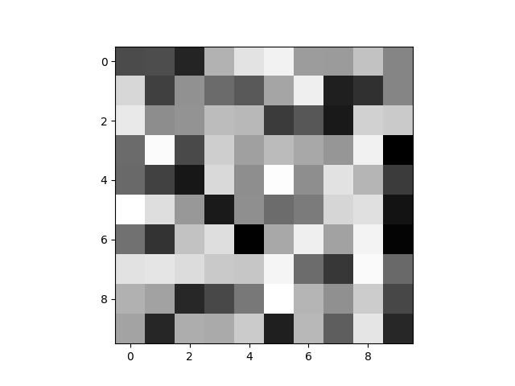
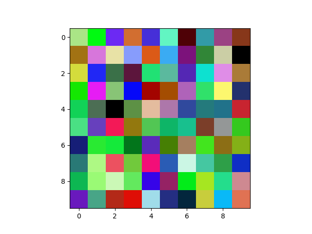
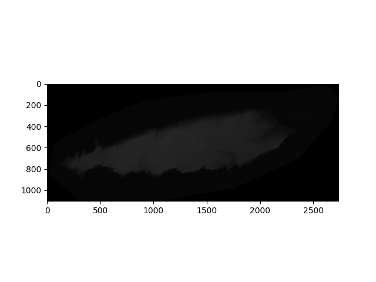
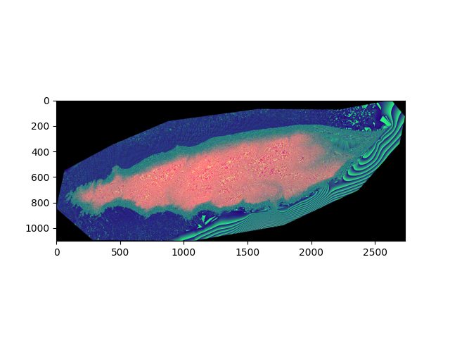

# rgbz
<p float="center">
  
   
</p>

Mapping elevation data to 24-bit RGB in PNG tiles.

## Description

`rgbz` encodes elevation (z-axis) data into the RGB channels of PNG images for efficient storage and intuitive visualization.

## Features

- Encode elevation data into RGB PNG tiles.
- Decode RGB PNG to extract elevation data.
- Render elevation using color gradients.

## Method 1: Encoding Elevation to RGB

This method translates elevation data into an RGB image representation:

1. **Clamping:** 
   - Elevation values are constrained between `MIN_ELEVATION` and `MAX_ELEVATION`.

2. **Normalization:** 
   - Data is scaled to fit within a [0,1] range.

3. **Scaling:** 
   - Elevation data is amplified by a factor of \(2^{24}\) in preparation for RGB conversion.

4. **Channel Conversion:** 
   - The 24-bit scaled elevation value is segregated into three 8-bit segments, corresponding to Red, Green, and Blue channels. This way, each channel represents a portion of the elevation, allowing a three-dimensional data representation using RGB colors.

5. **RGB Image Creation:** 
   - The separate R, G, and B arrays are then assembled to yield the RGB image, where each pixel color encodes an elevation value.

<p float="center">
  
   
</p>


## Installation

```bash
git clone https://github.com/kkmcgg/rgbz.git
cd rgbz
pip install -r requirements.txt
```

## Usage

# Encode elevation data
python rgbz.py encode --input elevation_data.txt --output encoded_image.png

# Decode RGB PNG
python rgbz.py decode --input encoded_image.png --output elevation_data.txt

# Testing 

python -m unittest discover -s rgbz/tests

# Contributing
Pull requests are welcome. For major changes, open an issue first.

# References

- [Mapbox Terrain-DEM v1](https://docs.mapbox.com/data/tilesets/reference/mapbox-terrain-dem-v1/) 
is a raster digital elevation model that provides high-resolution, global elevation data encoded into RGB values within PNG tiles for Mapbox's mapping platform.

# License
[MIT](https://choosealicense.com/licenses/mit/)
